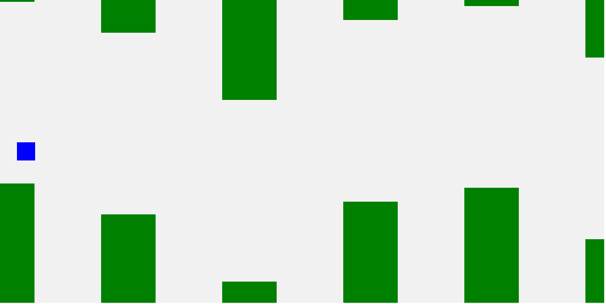

# Temporary Game Name

### https://wonusuh.github.io/JavaScriptGameProject/

### 개발동기 - HTML, CSS, JavaScript 로 구현 된 게임을 제작하고자 함.

### 구현할 기능
1. 캐릭터는 상하좌우로 ***이동*** 할 수 있다.
2. 캐릭터는 ***점프*** 할 수 있다.
3. 지형이 왼쪽으로 이동하므로 마치 플레이어가 오른쪽으로 이동하는것처럼 보인다.
4. 지형의 모양은 ***무작위로 생성*** 된다.
5. 생존한 시간에따라 ***score*** 를 얻는다.
6. 시간이 지남에따라 ***난이도가 증가*** 한다.
